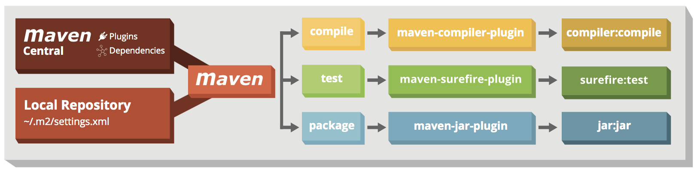

# Maven 实践出真知
Apache Maven，是一个软件（特别是Java软件）项目管理及自动构建工具

什么是构建工具：

* 生成源码（如果项目使用自动生成源码）；
* 从源码生成项目文档；
* 编译源码；
* 将编译后的代码打包成JAR文件或者ZIP文件；
* 将打包好的代码安装到服务器、仓库或者其它的地方；

## Maven 仓库
* 中央仓库
	
	Maven的中央仓库由Maven社区提供。默认情况下所有不在本地仓库中的依赖都回去这个中央仓库查找，然后下载到本地仓库。
* 远程仓库
	
	位于服务器的仓库，Maven可以从该仓库下载依赖
* 本地仓库
	
	个人电脑的仓库，存放下载的依赖

可以在pom文件里配置远程仓库。将以下的xml片段放到属性之后：

```xml
<repositories>
   <repository>
       <id>example</id>
       <url>http://example.com/maven2/lib</url>
   </repository>
</repositories>
```

## Maven create project

创建项目示例命令：

`mvn archetype:generate -DgroupId=org.yourcompany.project -DartifactId=application`

生成的项目结构如下：


标准目录结构：

```
- src
  - main
    - java
    - resources
    - webapp
  - test
    - java
    - resources

- target
```


## Maven architecture



以下为一些基本的maven执行命令，build期间执行的就是这些命令


| maven操作 | 功能用途 |
|----------|---------|
| clean | delete target directory |
| validate |validate, if the project is correct|
| compile |compile source code, classes stored in target/classes|
| test |run tests|
| package |take the compiled code and package it in its distributable format, e.g. JAR, WAR|
| verify |run any checks to verify the package is valid and meets quality criteria|
| install |install the package into the local repository|
| deploy |copies the final package to the remote repository|


## Maven Plugin

Maven 默认情况下，会根据几个常用操作选择默认的插件：

|plugin				|			function	| life cycle phase |
|-------------------|-------------------|------------------|
|maven-clean-plugin	|		清理上一次执行创建的目标文件 |clean |
|maven-resources-plugin	|	处理源资源文件和测试资源文件 |resources,testResources|
|maven-compiler-plugin	|	编译源文件和测试源文件      |compile,testCompile|
|maven-surefire-plugin	|		执行测试文件           |test|
|maven-jar-plugin		|		创建 jar	           |jar |
|maven-install-plugin	|		安装 jar，将生成的jar安装到.m2/repository下面|install|
|maven-deploy-plugin	|		发布 jar	|deploy|

## Maven Profile
针对不同的环境采用不同的配置，如开发环境和生产环境使用不一样的配置参数

```xml
<profiles>
    <profile>
      <id>test</id>
      <activation>...</activation> 
      <build>...</build>
      <modules>...</modules>
      <repositories>...</repositories>
      <pluginRepositories>...</pluginRepositories>
      <dependencies>...</dependencies>
      <reporting>...</reporting>
      <dependencyManagement>...</dependencyManagement>
      <distributionManagement>...</distributionManagement>
    </profile>
  </profiles>
```

多profile选择示例：

```xml
<profiles>
    <profile>
        <!-- 本地开发环境 -->
        <id>dev</id>
        <properties>
            <profiles.active>dev</profiles.active>
        </properties>
        <activation>
            <!-- 设置默认激活这个配置 -->
            <activeByDefault>true</activeByDefault>
        </activation>
 		   <build>  
              <filters>  
                  <filter>src/main/resources/dev.properties</filter>  
              </filters>  
          </build>  
    </profile>
    <profile>
        <!-- 发布环境 -->
        <id>release</id>
        <properties>
            <profiles.active>release</profiles.active>
        </properties>
		  <build>  
             <filters>  
                 <filter>src/main/resources/release.properties</filter>  
             </filters>  
         </build>  
    </profile>
    <profile>
        <!-- 测试环境 -->
        <id>beta</id>
        <properties>
            <profiles.active>beta</profiles.active>
        </properties>
 		  <build>  
              <filters>  
                  <filter>src/main/resources/beta.properties</filter>  
              </filters>  
         </build>  
    </profile>
</profiles> 

	<build>  
	<!--该元素设置了项目源码目录，当构建项目的时候，构建系统会编译目录里的源码。该路径是相对于pom.xml的相对路径。-->
        <finalName>myweb</finalName>  
        <resources>  
            <resource>  
                <directory>src/main/resources</directory>  
                <includes>  
                    <include>**/*</include>  
                </includes>  
				   <!--是否使用参数值代替参数名。参数值取自properties元素或者文件里配置的属性，文件在filters元素里列出。--> 
                <filtering>true</filtering>  
                <excludes>  
                    <exclude>application-text.xml</exclude>  
                    <!--<exclude>src/main/resources/application-text.xml</exclude>-->  
                </excludes>  
            </resource>  
        </resources>  
        <!-- <filters> 可以直接在profile的build中配置filter，也可以采用如下方式-->  
            <!--<filter>src/main/resources/${profiles.active}.properties</filter>-->  
        <!--</filters>-->  
    </build>  
```

通过` <activeByDefault>true</activeByDefault>`指定默认环境为dev

1. **profiles**：定义各个环境的变量配置，我上面的代码中有三个环境，所以配了3个profile
	* `<id>`: profile的标示
	* `<properties>`: 自己定义的一些属性，可有可无，比如我配置的jdbc.url这些属性，如果不想通过properties定义这些，可以在改属性下面配置
	* `<filters>`: 比较重要，指定当前profile环境下，属性文件路径；

2. **build** 的配置

* defaultGoal，执行构建时默认的goal或phase，如`jar:jar`或者package等
* directory，构建的结果所在的路径，默认为`${basedir}/target`目录
* finalName，构建的最终结果的名字，该名字可能在其他 plugin 中被改变
* `<resource>`下面的属性
	* `<directory>`: 资源文件的路径，默认位于`${basedir}/src/main/resources/`目录下，配置目录下的文件通过`${key}`会被替换成属性值
	* `<includes>`：一组文件名的匹配模式，被匹配的资源文件将被构建过程处理
	* `<filtering>`：构建过程中是否对资源进行过滤，默认false。即用环境变量、pom文件里定义的属性和指定配置文件里的属性替换属性(*.properties)文件里的占位符(如：`${jdbc.url}`)。
	* `<exclueds>`：一组文件名的匹配模式，被匹配的资源文件将被构建过程忽略。同时被includes和excludes匹配的资源文件，将被忽略。
* `<filters>`：给出对资源文件进行过滤的属性文件的路径（即用于参数值属性替换的数据来源）。这里的filters与`<profile>`的 filter 意思一样，都是指属性文件地址，这个如果上面定义`<profile>`的时候指定了，这里就不需要了，但有些开发习惯是在`<profile>`不定义，然后在`<build>`里指定。

**那么如何选择不同的配置环境呢？**

`mvn clean package -PprofileId`   通过指定`profileId`即可

`activation`：声明一些需要满足的条件，即当满足这些条件的时候，当前profile才被激活
如：

```xml
<profiles>
    <profile>
      <id>test</id>
      <activation>
        <activeByDefault>false</activeByDefault>
        <jdk>1.5</jdk>
        <os>
          <name>Windows XP</name>
          <family>Windows</family>
          <arch>x86</arch>
          <version>5.1.2600</version>
        </os>
        <property>
          <name>sparrow-type</name>
          <value>African</value>
        </property>
        <file>
          <exists>${basedir}/file2.properties</exists>
          <missing>${basedir}/file1.properties</missing>
        </file>
      </activation>
      ...
    </profile>
  </profiles>
```

## Maven scope

&lt;dependency&gt; 依赖属性配置过程中，属性项中包含 &lt;scope&gt; ，它主要管理依赖的部署。目前 &lt;scope&gt; 可以使用 5 个值： 

* `compile`，缺省值，适用于所有阶段，会随着项目一起发布。 
* `provided`，类似 compile，期望 JDK、容器或使用者会提供这个依赖。如servlet.jar, 不发布。
* `runtime`，只在运行时使用，如 JDBC 驱动，适用运行和测试阶段。 
* `test`，只在测试时使用，用于编译和运行测试代码。不会随项目发布。 
* `system`，类似 provided，需要显式提供包含依赖的 jar，Maven 不会在 Repository 中查找它。

## Maven build & test

TODO

## Maven package

首先看常用的集中打包插件：

* maven-jar-plugin: This plugin provides the capability to build and sign jars. But it just compiles the java files under src/main/java and /src/main/resources/. **It doesn't include the dependencies JAR files**. ( you should specify the main class when you run you jar in this way. )

* maven-assembly-plugin: This plugin extracts all dependency jars into raw classes, and group it together. It can also be used to build an executable jar by specifying the main class. It works in project with less dependencies only, for large project with many dependencies, it will cause Java class name conflict issue.

* maven-shade-plugin: It packages all dependencies into one uber-jar. It can also be used to **build an executable jar by specifying the main class**. This plugin is particularly useful as it merges content of specific files instead of overwriting them by Relocating Classes. This is needed when there are resource files that are have the same name across the jars and the plugin tries to package all the resource files.

其中默认插件是：aven-jar-plugin， 只要在pom文件中指定了打包方式为`<packaging>jar</packaging>`，则默认使用该插件，但是该插件不会将所有依赖包都打包进jar。
如果配置的是 `<packaging>war</packaging>` 则自动引入 `maven-war-plugin`。

### 用maven-shade-plugin打包

IDEA 自身的打包过程过于繁琐，而且也没有利用到maven管理项目的特色。为此，我们这里利用maven中的`maven-shade-plugin`插件。在pom.xml中，我们加入如下的信息来加入插件。

```xml
<plugin>
    <groupId>org.apache.maven.plugins</groupId>
    <artifactId>maven-shade-plugin</artifactId>
    <version>1.4</version>
    <configuration>
        <createDependencyReducedPom>true</createDependencyReducedPom>
    </configuration>
    <executions>
        <execution>
            <phase>package</phase>
            <goals>
                <goal>shade</goal>
            </goals>
            <configuration>
                <transformers>
                    <transformer implementation="org.apache.maven.plugins.shade.resource.ManifestResourceTransformer">
                        <mainClass>Main.Main</mainClass>
                    </transformer>
                </transformers>
            </configuration>
        </execution>
    </executions>
</plugin>
```

这里面配置了一个 `configuration` 标签内容，在此标签下面 有一个transformer标签，用来配置Main函数的入口`<mainClass>Main.Main</mainClass>`，当然此标签内容很复杂，不是上面写的那么简单，上面之所以如此简单，是因为在所有类中(包括第三方Jar)只有一个Main方法。如果第三方jar中有Main方法，就要进行额外的配置，上面这么配置，不一定能执行成功。

在加入这段代码到pom.xml之后，我们就可以用maven的命令去打包了。其指令如下：

```
mvn clean compile //清除之前target编译文件并重新编译
mvn clean package //对项目进行打包(因为配置过插件，所以jar包是可执行的)
mvn clean install //安装项目，然后就可以使用了
```

然后通过`java -jar cps-1.0-SNAPSHOT.jar` 运行。

如果使用IDEA的话，可以通过自带的maven管理工具代替执行上面的命令，一次点击上述命令对应用的操作按键。

### 用maven-assembly-plugin打包，一次操作

上面的方法，我们还需要点击很多命令去打包。这次利用一个新的插件，可以打包更简单。同样，在`pom.xml`中加入如下代码。上文的`maven-shade-plugin`插件代码可以删除。**最好不要写2个插件代码**。

```xml
<plugin>
    <artifactId>maven-assembly-plugin</artifactId>
    <version>2.4</version>
    <configuration>
        <descriptorRefs>
            <descriptorRef>jar-with-dependencies</descriptorRef>
        </descriptorRefs>
        <archive>
            <manifest>
                <mainClass>Main.Main</mainClass>
            </manifest>
        </archive>
    </configuration>
    <executions>
        <execution>
            <id>make-assembly</id>
            <phase>package</phase>
            <goals>
                <goal>single</goal>
            </goals>
        </execution>
    </executions>
</plugin>
```

这里同样配置了一个manifest标签来配置Main函数的入口。然后通过如下指令来实现打包。

```sh
mvn assembly:assembly
```

如果使用IDEA的话，可以通过自带的maven管理工具代替执行上面的命令

然后通过执行`java -jar cps-1.0-SNAPSHOT-jar-with-dependencies.jar`运行。

### SpringBoot 的 spring-boot-maven-plugin 插件打包方式

**对于SpringBoot应用，理论上具备自动检测主类的功能，不需要再自行定义MainClass**

在pom文件中引入：

```xml
<build>
		<plugins>
			<plugin>
				<groupId>org.springframework.boot</groupId>
				<artifactId>spring-boot-maven-plugin</artifactId>
			</plugin>
		</plugins>
	</build>
```

具体操作：

* 通过`mvn clean package`命令打包应用程序
* 通过命令`java -jar target/bookpub-0.0.1-SNAPSHOT.jar`运行程序

背后的工作由`spring-boot-maven-plugin`插件实现：先通过`maven-shade-plugin`生成一个包含依赖的jar，再通过`spring-boot-maven-plugin`插件把spring boot loader相关的类，还有MANIFEST.MF打包到jar里

## 常见问题

### 如何将所有的依赖一起打包呢？

使用`maven-assembly-plugin`打包插件，增加相应配置

```xml
<plugin>
	<artifactId>maven-assembly-plugin</artifactId>
	<configuration>
	  <descriptorRefs>
	    <descriptorRef>jar-with-dependencies</descriptorRef>
	  </descriptorRefs>
	</configuration>
</plugin>
```

### 如何将一个jar包手动放到本地的maven仓库

```xml
mvn install:install-file
  -Dfile=<path-to-file>
  -DgroupId=<group-id>
  -DartifactId=<artifact-id>
  -Dversion=<version>
  -Dpackaging=<packaging>
  -DgeneratePom=true
 
Where: <path-to-file>  the path to the file to load
       <group-id>      the group that the file should be registered under
       <artifact-id>   the artifact name for the file
       <version>       the version of the file
       <packaging>     the packaging of the file e.g. jar
```

### maven 是如何进行依赖仲裁的?

依照如下顺序：

1. 按项目 pom.xml 的 dependencyManagement 进行仲裁
2. 如无仲裁声明，则路径最短的胜出
3. 若路径相同，则有严格的版本区间胜出
4. 若路径相同，且无严格版本区间，则先入为主

参照：

* [Maven Cheat Sheet zeroturnaround.com](https://zeroturnaround.com/rebellabs/maven-cheat-sheet/)

* [Maven pom.xml 配置详解 - CSDN博客](https://blog.csdn.net/ithomer/article/details/9332071)

* [Maven – POM Reference](http://maven.apache.org/pom.html)
