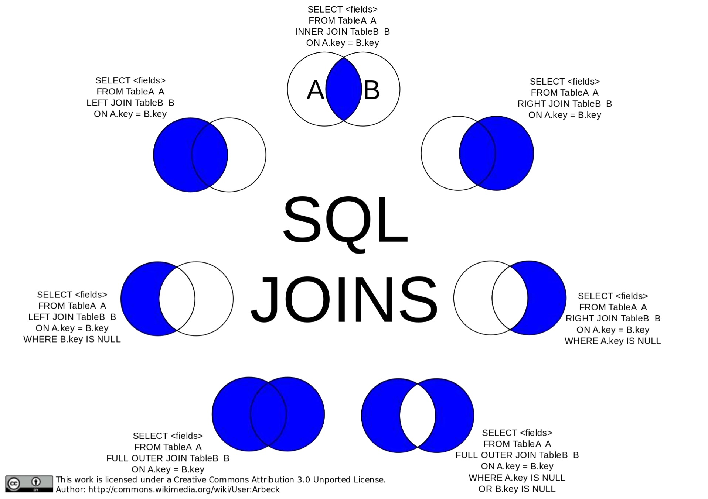

# MySQL 基础操作


## 表的基本操作

### 创建新表

```sql
create tablename (
	id int unsigned not null auto_increment,
	username varchar(100) not null,
	email varchar(100) not null,
	primary key (id)
);

```
### 表的查询操作

```sql
select * from tablename where id = 1;
```

### 表的数据插入操作

```sql
insert into tablename(username, email) values("username","email");

#多项数据同时插入
insert into tablename (username, email) values ('a','a@qq.com'),('b','b@qq.com');
```

### 表的数据更新操作

```sql
update tablename set username="uname" where id = 1;
```

### 表的数据删除操作

```sql
delete from tablename where id = 1;
```

## 用户操作

### 创建新用户

```sql
#创建本地访问的用户
create user 'user'@'localhost' identified by 'mypassword';

#创建本地和远程皆可访问的用户，@表示任何远程主机
create user 'user'@'%' identified by 'mypassword';
```

### 为用户授权

```sql
#将databaseName数据库下的所有表的select,insert,update权限授予从localhost访问的user用户
grant select, insert, update on databaseName.* to 'user'@'localhost'

#将所有库所有表的全部权限授予从localhost访问的user用户
grant all on *.* to 'user'@'localhost' with grant option

#with grant option 代表允许user用户为其他用户授权
```

ALL 代表了以下权限：

* SELECT
* INSERT
* UPDATE
* DELETE
* CREATE
* DROP

## 常用数据类型

### 字符类型

通常我们会使用`varchar`来实现可变长的字符类型
或者使用`char`实现固定长度的字符，同时还可以为字符指定编码类型，如：

```sql
country_code CHAR(2) CHARACTER SET ascii
```

由于不同类型的编码所带来的存储开销不一样，所以有必要针对所需存储的数据指定编码类型

### 日期类型，表时间

日期类型主要有以下几种：

1. DATE， 格式为’YYYY-MM-DD’, 时间范围’1000-01-01’ to ’9999-12-31’
2. DATETIME， 格式为’YYYY-MM-DD HH:MM:SS’，时间范围’1000-01-01 00:00:00’ to ’9999-12-31 23:59:59’
3. TIMESTAMP， 整数类型，代表的是从指定时间开始，到取值此刻的毫秒数，指定时刻为’1970-01-01 00:00:01’
4. YEAR， 代表的是当前年份，整数
5. TIME， 格式为’HH:MM:SS’，不带年月日的纯时间

### 数值类型

#### 整数类型

整型对应字节数：

* TINYINT     1
* SMALLINT    2
* MEDIUMINT   3
* INT         4
* BIGINT      8

#### 定点类型

指定小数点之后有几位，用`DECIMAL(a,b)` ，a代表有效数，b代表小数个数

```sql
salary	DECIMAL(5,2)
```

#### 浮点类型

主要有`DOUBLE`和`FLOAT` 两种类型


## 查询操作

典型形式：`select * from tableName`

### 带DISTINCT

去重，注意是针对select后面全部列来去重，并不针对某一列的重复

`select distinct name,price from cat` 例如这个例子，去重是针对name和price都一致的重复项

### 带IF选择条件判断

通过`IF`或者`CASE WHEN` 实现选择条件判断

```sql
select st.name, st.percentage,
		CASE WHEN st.percentage >= 35 THEN 'PASS' ELSE 'FAIL' END AS 'Remark'
		FROM student AS st

#等价于

select st.name, st.percentage,
		IF(st.percentage >= 35, 'PASS', 'FAIL') AS 'Remark'
		FROM student AS st

#得到的输出项：
#name		percentage		Remark
```

### Alias(AS) 别名

```sql
select username AS val From stack;

#得到的输出结果的表示项就是: val
```

### 带limit

通过`limit`来限制输出结果行数

limit后面如果只有一个数字，代表的是输出的总行数，	`limit count`
limit后面如果有两个数字，代表的是起始的偏移量以及输出总行数，`limit offset, count`

offset 是从0开始

### 带BETWEEN

BETWEEN 等价于 >= & <=

```sql
select * from stack where id >= 2 AND id <= 5

equals:

select * from stack where id between 2 and 5
```

### 选择条件中带有日期表示

```sql
select ... where dt >= '2017-02-01' and dt < 2017-02-01' + INTERVAL 1 MONTH
```

注意这里最后的 `+ INTERVAL 1 MONTH`，可以方便使用，不需要自己强行计算得到一个时间结果
这种使用方式对于DATE，TIMESTAMP，DATETIME 都可行

## 引号

### 反引号 ``

反引号的作用主要是区分保留字符，比如`group`，因为mysql中分组会用到，是属于功能型字符，所以当创建的数据库、表或者列名为group时候，需要加上反引号，不然会报错

当然，在一般的列名加上反引号也都OK

eg.

```sql
SELECT `username` FROM student GROUP BY `group`
```

### 单引号与双引号

正常用途，用于表示字符串变量（数字不需要加），通常采用单引号，因为其中如果有双引号的话不需要再转义


## 数据库操作

### 创建数据库

```sql

create database DB;

# 或者先判断数据库是否存在

create database if not exists DB;

# 指定字符集

create database DB character set utf8 collate utf8_general_ci;

# 设置当前使用数据库

use DB;

```

### 删除数据库

```sql

drop database DB;

# 先判断数据库是否存在，再删除

drop database if exists DB

```


## 变量

### 定义变量

几种定义变量的方式

1. 使用 SET 进行变量赋值，如`SET @var_string = 'my_var' `
2. 使用 select 结合 := 为查询返回值赋值到变量，如 `select @var := '123'` , 注意在一般操作（非 SET 操作）中 = 是用于等值比较，所以赋值需要采用 := 
3. 使用 INTO 定义变量表示 SELECT 查询返回结果

### 行数

使用变量，为查询结果每行数据加上行号

```sql

SELECT @row_no := @row_no+1 AS ROW_NUMBER, team, person
FROM team_person, (SELECT @row_no := 0) t;

equals:

SET @row_no := 0;
SELECT @row_no := @row_no + 1 AS row_number, team, person
FROM team_person;

```
 
## 插入操作补充

## INSERT SELECT

从别的表中读取数据并插入到指定表

```sql

INSERT INTO tableA (field_one, field_two)
		SELECT tableB.field_one, tableB.field_two
		FROM tableB
		WHERE tableB.clmn <> 2
		ORDER BY tableB.sorting_clmn

```

## 删除操作补充

一般性的删除操作

```sql
delete from mytable where id = 1;
```

带别名的删除操作

```sql
delete m from mytable m where m.id = 1;
```

## 更新操作补充

## Group

“Group By”从字面意义上理解就是根据“By”指定的规则对数据进行分组，所谓的分组就是将一个数据集划分成若干个小区域，然后针对若干个小区域进行数据处理。

having 则是在进行分组时候对**组**进行相应的筛选

对于一些特定数据库，如SQLServer ，会Group By中Select指定的字段限制:

1. 在select指定的字段**要么就要包含在Group By语句的后面**，作为分组的依据；**要么就要被包含在聚合函数中**
2. 在having中的元素也必须是包含在select里边

而对于其他的数据库，例如mysql

由于group by会将查询得到的数据分为若干个组，select 后面的列，如果是作为group的依据，那么肯定是只有一定值，如果select后面的列项不是作为group的依据，那么输出的值仅仅取组中首行数据的该列值

## Join

一图胜千言：



典型用例：

```sql
select * from table1 left join table2 on table1.id = table2.id where table1.id > 10;
```

注：SQL 中 is 与 = 的区别

* = 用于一般性的比较，不能用于NULL的比较
* is 仅仅用于NULL 的判断（is not 也是）

```sql
# 需要判断表Foo中的Bar列值是否为 @param 指定的值时，应当如下：
Select * from Foo where (@param is null and Bar is null) or (Bar = @param)
```

## 计算方法

一般算数运算

* + ,     	2+5 -> 7
* -,       	5-2 -> 3
* *,       	2*3 -> 6
* / or DIV,   355/113 -> 3.1416,   5 DIV 2 -> 2
* % or MOD,   7 / 3 -> 1

三角运算

* PIE() ->  3.1415
* SIN()
* COS()
* TAN()
* ACOS()
* ASIN()
* ATAN()

取整运算

* ROUN()， 四舍五入
* CEIL()，上取整
* FLOOR()，下取整

运算：

* POW(a,b) -> a的b次方
* SQRT() -> 开平方
* ABS() -> 绝对值


## 日期与时间操作

```sql

NOW() + INTERVAL 1 DAY  -- this time tomorrow

CURDATE() - INTERVAL 4 DAY  -- midnight 4 mornings ago

```

常用方法：

* SYSDATE()	return the current date and time as a value in ‘YYYY-MM-DD HH:MM:SS’
* NOW()		the same to the above
* CURDATE()	return the current date without any time, means in ‘YYYY-MM-DD’


## 视图 view

构建一张虚拟的表，仅仅展示实际表中需要展示的部分列

用例：

```sql
create view v as select * from mytable;

#show all views in table
show full tables in dbname where Table_type = 'VIEW'
```


## Mysql 外键操作

外键有性能问题：

1. 数据库需要维护外键的内部管理；
2. 外键等于把数据的一致性事务实现，全部交给数据库服务器完成；
3. 有了外键，当做一些涉及外键字段的增，删，更新操作之后，需要触发相关操作去检查，而不得不消耗资源；
4. 外键还会因为需要请求对其他表内部加锁而容易出现死锁情况；

对于外键的态度：能不用就不用

## 创建表补充

从 select 得到的数据信息中创建新表

```sql

create table table1 as select * from table2

create table table3 as select username, password from DB1.tablename; 

```

更新时间记录

```sql

create table table1 (
	ID	int not null,
	name	varchar(50)	null,
	address	varchar(50) null,
	lastUpdate	TIMESTAMP	NULL DEFAULT CURRENT_TIMESTAMP ON UPDATE CURRENT_TIMESTAMP
)

```


## 存储引擎

存储引擎说白了就是如何存储数据、如何为存储的数据建立索引和如何更新、查询数据等技术的实现方法，因为在关系数据库中数据的存储是以表的形式存储的，所以存储引擎也可以称为表类型（即存储和操作此表的类型）。

MySql区别于其它数据库系统的一个重要特点是支持插入式存储引擎

当前采用最多的是MyISAM 与 InnoDB，两者的主要区别在于：

1. MyISAM类型的表强调的是性能，其执行数度比InnoDB类型更快，但是不提供事务支持
而InnoDB提供事务支持事务，外部键（foreign key）等高级数据库功能
2. 如果执行大量的SELECT，MyISAM是更好的选择
但是其他操作InnoDB更优：
  
  1. 如果你的数据执行大量的INSERT或UPDATE，出于性能方面的考虑，应该使用InnoDB表
  2. DELETE   FROM table时，InnoDB不会重新建立表，而是一行一行的删除。
  3. LOAD   TABLE FROM MASTER操作对InnoDB是不起作用的，解决方法是首先把InnoDB表改成MyISAM表，导入数据后再改成InnoDB表，但
    是对于使用的额外的InnoDB特性（例如外键）的表不适用
3. MyISAM只提供表锁，而InnoDB提供行级锁

总结来看，两者最主要的差别就是 Innodb 支持**事务处理**和**行级锁**

作为使用MySQL的用户角度出发，Innodb和MyISAM都是比较喜欢的，如果数据库平台要达到需求：99.9%的稳定性，方便的扩展性和高可用性来说的话，MyISAM绝对是首选。

原因如下：

1. 平台上承载的大部分项目是读多写少的项目，而MyISAM的读性能是比Innodb强不少的。

2. MyISAM的索引和数据是分开的，并且索引是有压缩的，内存使用率就对应提高了不少。能加载更多索引，而Innodb是索引和数据是紧密捆绑的，没有使用压缩从而会造成Innodb比MyISAM体积庞大不小。

3. 经常隔1，2个月就会发生应用开发人员不小心update一个表where写的范围不对，导致这个表没法正常用了，这个时候MyISAM的优越性就体现出来了，随便从当天拷贝的压缩包取出对应表的文件，随便放到一个数据库目录下，然后dump成sql再导回到主库，并把对应的binlog补上。如果是Innodb，恐怕不可能有这么快速度，别和我说让Innodb定期用导出xxx.sql机制备份，因为最小的一个数据库实例的数据量基本都是几十G大小。

4. 从接触的应用逻辑来说，select count(*) 和order by 是最频繁的，大概能占了整个sql总语句的60%以上的操作，而这种操作Innodb其实也是会锁表的，很多人以为Innodb是行级锁，那个只是where对它主键是有效，非主键的都会锁全表的。

5. 还有就是经常有很多应用部门需要我给他们定期某些表的数据，MyISAM的话很方便，只要发给他们对应那表的frm.MYD,MYI的文件，让他们自己在对应版本的数据库启动就行，而Innodb就需要导出xxx.sql了，因为光给别人文件，受字典数据文件的影响，对方是无法使用的。

6. 如果和MyISAM比insert写操作的话，Innodb还达不到MyISAM的写性能，如果是针对基于索引的update操作，虽然MyISAM可能会逊色Innodb,但是那么高并发的写，从库能否追的上也是一个问题，还不如通过多实例分库分表架构来解决。

7. 如果是用MyISAM的话，merge引擎可以大大加快应用部门的开发速度，他们只要对这个merge表做一些select count(*)操作，非常适合大项目总量约几亿的rows某一类型(如日志，调查统计)的业务表。

当然Innodb也不是绝对不用，用事务的项目就用Innodb的。另外，可能有人会说你MyISAM无法抗太多写操作，但是可以通过架构来弥补。


## 索引

在索引列上，除了上面提到的有序查找之外，数据库利用各种各样的快速定位技术，能够大大提高查询效率

索引的类型：

* a
* b
* c

创建索引的方式：

1、 在创建表的时候通过 index 或者 key 来定义索引

`index/key  [indexName] (columnName)`

```sql
(
	key table_index_pid (pid)
)
```

2、 alter 修改表结构时候增加索引

`ALTER table tableName ADD INDEX indexName(columnName)`

3、 直接创建suoyin

`CREATE INDEX indexName ON mytable(columnName); `

删除索引：

```sql
DROP INDEX index_name ON talbe_name

ALTER TABLE table_name DROP INDEX index_name

ALTER TABLE table_name DROP PRIMARY KEY
```

查看索引：

```sql
show index from tablename;

show keys from tablename;
```