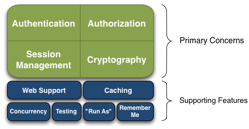
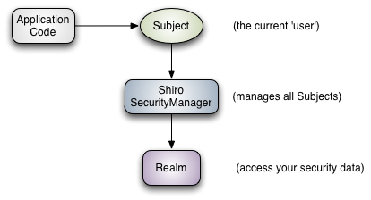
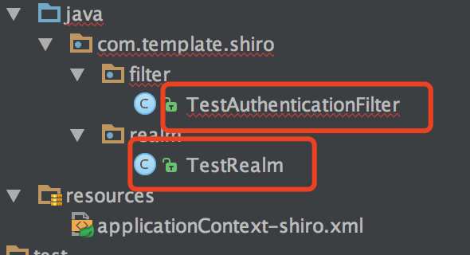
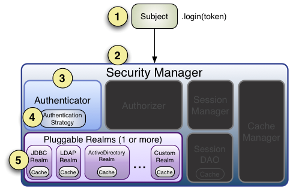
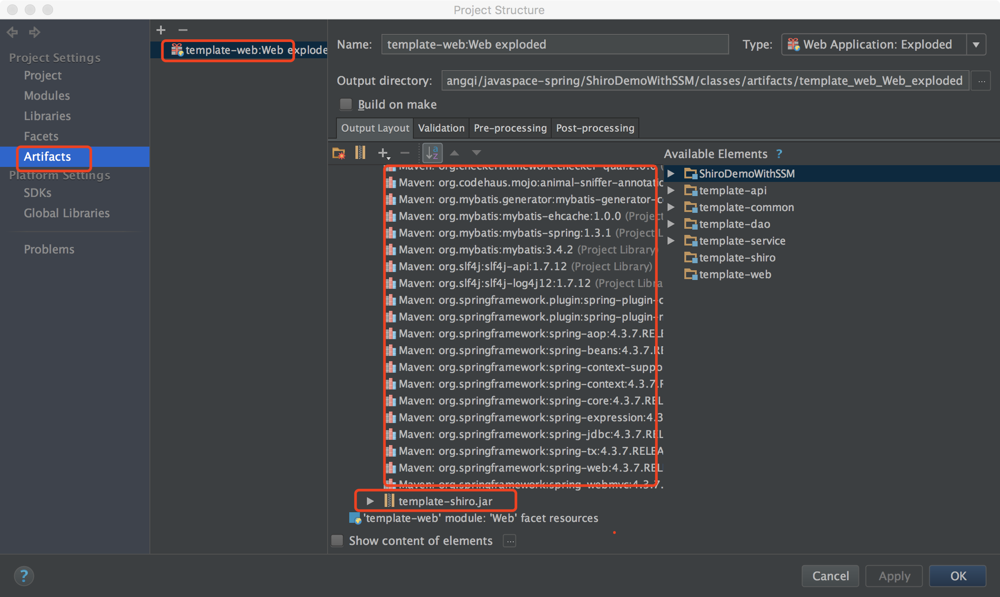

# SpringMVC 结合Shiro实现权限控制

Apache Shiro是Java的一个安全框架，以帮助我们完成：认证、授权、加密、会话管理、与Web集成、缓存等。

Shiro的基本功能如图：



* `Authentication`：身份认证/登录，验证用户是不是拥有相应的身份；
* `Authorization`：授权，即权限验证，验证某个已认证的用户是否拥有某个权限；即判断用户是否能做事情，常见的如：验证某个用户是否拥有某个角色。或者细粒度的验证某个用户对某个资源是否具有某个权限；
* `Session Manager`：会话管理，即用户登录后就是一次会话，在没有退出之前，它的所有信息都在会话中；会话可以是普通JavaSE环境的，也可以是如Web环境的；
* `Cryptography`：加密，保护数据的安全性，如密码加密存储到数据库，而不是明文存储；
* `Web Support`：Web支持，可以非常容易的集成到Web环境；
* `Caching`：缓存，比如用户登录后，其用户信息、拥有的角色/权限不必每次去查，这样可以提高效率；
* `Concurrency`：shiro支持多线程应用的并发验证，即如在一个线程中开启另一个线程，能把权限自动传播过去；
* `Testing`：提供测试支持；
* `Run As`：允许一个用户假装为另一个用户（如果他们允许）的身份进行访问；
* `Remember Me`：记住我，这个是非常常见的功能，即一次登录后，下次再来的话不用登录了。

记住一点，Shiro不会去维护用户、维护权限；这些需要我们自己去设计/提供；然后通过相应的接口注入给Shiro即可。



可以看到：应用代码直接交互的对象是Subject，也就是说Shiro的对外API核心就是Subject；其每个API的含义：

* `Subject`：主体，代表了当前“用户”（可以理解为当前的web访问会话），这个用户不一定是一个具体的人，与当前应用交互的任何东西都是Subject，如网络爬虫，机器人等；即一个抽象概念；所有Subject都绑定到SecurityManager，与Subject的所有交互都会委托给SecurityManager；可以把Subject认为是一个门面；SecurityManager才是实际的执行者；
* `SecurityManager`：安全管理器；即所有与安全有关的操作都会与SecurityManager交互；且它管理着所有Subject；可以看出它是Shiro的核心，它负责与后边介绍的其他组件进行交互，如果学习过SpringMVC，你可以把它看成DispatcherServlet前端控制器；
* `Realm`：域，Shiro从从Realm获取安全数据（如用户、角色、权限），就是说SecurityManager要验证用户身份，那么它需要从Realm获取相应的用户进行比较以确定用户身份是否合法；也需要从Realm得到用户相应的角色/权限进行验证用户是否能进行操作；可以把Realm看成DataSource，即安全数据源。

也就是说对于我们而言，最简单的一个Shiro应用：

1. 应用代码通过Subject来进行认证和授权，而Subject又委托给SecurityManager；
2. 我们需要给Shiro的SecurityManager注入Realm，从而让SecurityManager能得到合法的用户及其权限进行判断。

本文主要从一个典型的案例出发，记录Shiro结合SpringMVC的使用

`maven` 相关配置:

```xml
		   <dependency>
            <groupId>org.apache.shiro</groupId>
            <artifactId>shiro-core</artifactId>
            <version>${shiro.version}</version>
        </dependency>
        <dependency>
            <groupId>org.apache.shiro</groupId>
            <artifactId>shiro-web</artifactId>
            <version>${shiro.version}</version>
        </dependency>
        <dependency>
            <groupId>org.apache.shiro</groupId>
            <artifactId>shiro-spring</artifactId>
            <version>${shiro.version}</version>
        </dependency>
```

`applicationContext-shiro`配置项目:

```xml
<?xml version="1.0" encoding="UTF-8" ?>
<beans xmlns="http://www.springframework.org/schema/beans"
       xmlns:xsi="http://www.w3.org/2001/XMLSchema-instance" xmlns:util="http://www.springframework.org/schema/util"
       xmlns:context="http://www.springframework.org/schema/context"
       xsi:schemaLocation="http://www.springframework.org/schema/beans
	    http://www.springframework.org/schema/beans/spring-beans-3.0.xsd http://www.springframework.org/schema/util http://www.springframework.org/schema/util/spring-util.xsd http://www.springframework.org/schema/context http://www.springframework.org/schema/context/spring-context.xsd">

		<!-- 定义过滤器 -->
    <bean id="shiroFilter" class="org.apache.shiro.spring.web.ShiroFilterFactoryBean">
        <property name="securityManager" ref="securityManager" />
        <property name="loginUrl"   value="/test/login" />
        <property name="unauthorizedUrl" value="/test/403" />
        <property name="successUrl" value="/200" />
        <property name="filters">
            <util:map>
                <entry key="authc" value-ref="testAuthenticationFilter"></entry>
            </util:map>
        </property>
        <property name="filterChainDefinitions">
            <value>
                /test/index = authc
                /test/read = authc
                /test/write = authc
                /test/login = user
            </value>
        </property>
    </bean>

	 <!-- 过滤器 -->
    <bean id="testAuthenticationFilter" class="com.template.shiro.filter.TestAuthenticationFilter" />

	 <!-- 定义域 -->
    <bean id="testRealm" class="com.template.shiro.realm.TestRealm" />

    <!-- 安全管理器 -->
    <bean id="securityManager" class="org.apache.shiro.web.mgt.DefaultWebSecurityManager">
        <property name="realms">
            <list>
                <ref bean="testRealm" />
            </list>
        </property>
    </bean>

    <!-- 设置SecurityUtils，相当于调用SecurityUtils.setSecurityManager(securityManager) -->
    <bean class="org.springframework.beans.factory.config.MethodInvokingFactoryBean">
        <property name="staticMethod" value="org.apache.shiro.SecurityUtils.setSecurityManager"/>
        <property name="arguments" ref="securityManager"/>
    </bean>

    <!-- 开启Shiro Spring AOP权限注解@RequiresPermissions的支持 -->
    <bean class="org.springframework.aop.framework.autoproxy.DefaultAdvisorAutoProxyCreator" depends-on="lifecycleBeanPostProcessor" />

    <bean class="org.apache.shiro.spring.security.interceptor.AuthorizationAttributeSourceAdvisor">
        <property name="securityManager" ref="securityManager"/>
    </bean>

    <!-- Shiro生命周期处理器-->
    <bean id="lifecycleBeanPostProcessor" class="org.apache.shiro.spring.LifecycleBeanPostProcessor"/>

    <!-- 无权访问跳转的页面 -->
    <bean class="org.springframework.web.servlet.handler.SimpleMappingExceptionResolver">
        <property name="exceptionMappings">
            <props>
                <prop key="org.apache.shiro.authz.UnauthorizedException">refuse</prop>
            </props>
        </property>
    </bean>
</beans>
```

关键的两个类：



* TestRealm

完成身份认证和授权认证两件事情：

|方法|作用|
|----|----|
|doGetAuthorizationInfo  |授权认证|
|doGetAuthenticationInfo |身份认证|



流程如下：

1. 首先调用Subject.login(token)进行登录，其会自动委托给Security Manager，调用之前必须通过SecurityUtils. setSecurityManager()设置；
2. SecurityManager负责真正的身份验证逻辑；它会委托给Authenticator进行身份验证；
3. Authenticator才是真正的身份验证者，Shiro API中核心的身份认证入口点，此处可以自定义插入自己的实现；
4. Authenticator可能会委托给相应的AuthenticationStrategy进行多Realm身份验证，默认ModularRealmAuthenticator会调用AuthenticationStrategy进行多Realm身份验证；
5. Authenticator会把相应的token传入Realm，从Realm获取身份验证信息，如果没有返回/抛出异常表示身份验证失败了。此处可以配置多个Realm，将按照相应的顺序及策略进行访问。

```java

package com.template.shiro.realm;

import org.apache.shiro.authc.*;
import org.apache.shiro.authz.AuthorizationInfo;
import org.apache.shiro.authz.SimpleAuthorizationInfo;
import org.apache.shiro.realm.AuthorizingRealm;
import org.apache.shiro.subject.PrincipalCollection;

import java.util.HashSet;
import java.util.Set;

/**
 * 用户认证与授权
 */
public class TestRealm extends AuthorizingRealm{

    @Override
    protected AuthorizationInfo doGetAuthorizationInfo(PrincipalCollection principals) {

        String username = (String)principals.getPrimaryPrincipal();

        //当Controller中的访问方法用类似 @RequirePermission("test:read") ,进行了方法的权限约束时，需要到这里来检验该用户的权限

        Set<String> permissions = new HashSet();
        permissions.add("test:read");
        permissions.add("test:delete");

        SimpleAuthorizationInfo simpleAuthorizationInfo = new SimpleAuthorizationInfo();
        simpleAuthorizationInfo.setStringPermissions(permissions);

        return simpleAuthorizationInfo;
    }

    @Override
    protected AuthenticationInfo doGetAuthenticationInfo(AuthenticationToken token) throws AuthenticationException {
        String username = (String)token.getPrincipal();
        String password = new String((char[]) token.getCredentials());
		  
		  //Controller的访问方法中，利用subject.login(token),进行登录验证时，会到这里来进行登录验证，检查用户名密码是否争取
		  //这里一般是进行数据库访问或者RPC远程接口调用验证数据的正确性
        //check the username and password

        Object user = new Object();
        // get the user obj;

        if(user == null) {
            //用户不存在
            throw new UnknownAccountException();
        }
        else if(false) {
            //密码错误
            throw new IncorrectCredentialsException();
        }
        return new SimpleAuthenticationInfo(username, password, getName());
    }
}


```

* TestAuthenticationFilter

这是一个相对全局的配置，可以在xml中配置，指定的url访问时候触发该过滤器，也就是当访问指定的url时候，需要进入该过滤器的处理逻辑，判断是否允许访问

本例中，继承自AuthenticationFilter，也就是用于进行用户登录验证过滤，判断无法访问的话需要跳转到loginUrl

```java
public class TestAuthenticationFilter extends AuthenticationFilter {
    @Override
    protected boolean isAccessAllowed(ServletRequest request, ServletResponse response, Object mappedValue) {
        Subject subject = getSubject(request,response);
		  //例如，这里会判断当前会话用户是否已经完成登录操作，如果没有，那么返回的是false
        return subject.isAuthenticated();
    }

    @Override
    protected boolean onAccessDenied(ServletRequest request, ServletResponse response) throws Exception {

        if(!getSubject(request,response).isAuthenticated()) {
            WebUtils.toHttp(response).sendRedirect("/test/login");
        }

        return false;
   }
}
```


## 在SpringMVC的Controller中进行权限控制

典型案例如：

```java
@Controller
@RequestMapping("/test")
public class controller {

    @RequestMapping("index")
    public String index() {
        return "/index";
    }

    @RequestMapping(value = "/login", method = RequestMethod.GET)
    public String login() {
        return "/login";
    }

    @RequestMapping(value = "/login", method = RequestMethod.POST)
    @ResponseBody
    public String login(HttpServletRequest request) {
        Map<String, String> res = new HashMap<String, String>();

        String username = request.getParameter("username");
        String password = request.getParameter("password");

        Subject subject = SecurityUtils.getSubject();
        subject.login(new UsernamePasswordToken(username, password));

        return "1";
    }

    @RequiresPermissions("test:read")
    @RequestMapping("/read")
    public String read() {
        return "/read";
    }

    @RequiresPermissions("test:write")
    @RequestMapping("/write")
    public String write() {
        return "/write";
    }

    @RequestMapping("/403")
    public String sls() {
        return "/403";
    }
}
```

最后需要在`web.xml`中增加配置：

```xml
<!-- shiroFilter : DelegatingFilterProxy作用是自动到spring容器查找名字为shiroFilter（filter-name）的bean并把所有Filter的操作委托给它。然后将shiroFilter配置到spring容器即可 -->
<filter>
    <filter-name>shiroFilter</filter-name>
    <filter-class>org.springframework.web.filter.DelegatingFilterProxy</filter-class>
    <init-param>
        <param-name>targetFilterLifecycle</param-name>
        <param-value>true</param-value>
    </init-param>
</filter>
<filter-mapping>
    <filter-name>shiroFilter</filter-name>
    <url-pattern>/*</url-pattern>
</filter-mapping>
```

参照：

[在 Web 项目中应用 Apache Shiro](https://www.ibm.com/developerworks/cn/java/j-lo-shiro/)

[跟我学Shiro-开涛](http://www.iteye.com/blogs/subjects/shiro)


## 遇到的一些shiro异常问题:

- Realm中的`doGetAuthorizationInfo` 方法不执行，即Controller的访问方法上面配置了访问权限(requiresPermission), 但是还是不执行该方法

解决方法：

```xml
<aop:config proxy-target-class="true"/>
```

但是会引入下面问题2

- shiro 在配置aop时候配置注解异常 `java.lang.ClassNotFoundException: org.aspectj.util.PartialOrder$PartialComparable`

解决：缺少jar包

```xml
<!-- 解决shiro注解（shiro 使用 aop） -->
<dependency>
　　<groupId>aspectj</groupId>
　　<artifactId>aspectjweaver</artifactId>
　　<version>1.5.4</version>
</dependency>
```

- 当无权访问的时候，不跳转到未授权页面，而是直接报错

```xml
<!-- 无权访问跳转的页面 -->
<bean class="org.springframework.web.servlet.handler.SimpleMappingExceptionResolver">
　　<property name="exceptionMappings">
　　　　<props>
　　　　　　<prop key="org.apache.shiro.authz.UnauthorizedException">refuse</prop>
　　　　</props>
　　</property>
</bean>
```


另外，遇到的一些与IDEA的java项目相关的问题，这个比较重要：

1)  对于包含多个模块的项目，当模块A的pom文件中引入模板B作为依赖，直接运行后，在A中是可以直接使用B的类与方法等

尽管A启动之后并不会将B的内容打包进行自己的jar包，但是A得pom文件中写清楚依赖于A
那么对于之后，如果有项目依赖于A，但是A又不包含B的内容，怎么处理呢？

因为Maven的实际操作，基本是将需要的jar包都安装到本地，也就是根据pom文件的依赖路径，将所有依赖的jar包都安装到本地，并在maven解析之后有IDEA添加到项目的External Libraries，再在运行过程中加以运用


但是，如果A是需要以**web server**的方式启动，也就是需要讲A打包成war，那么就需要显示地将B以jar的形式添加到war中

具体步骤如下：


* 在Artifacts中创建war包，然后注意输出war路径，需要将需要的jar包都添加到输出路径中
* 可以在右侧的Avalilable Elements中选择自己需要引入到war中的jar，右键选择`PUT INTO WEB-INF/lib`
* 另外一种情况，需要将依赖的模块的编译代码文件同样引入war包（该server依赖于模块的代码），在右键双击点开模块，并在 module-name compile output 上右键选择`Pack Into /WEB-INF/lib/module-name.jar`

2) 关于SpringMVC项目中，Controller处理之后返回jsp页面的问题：

jsp配置：

```xml
<!-- Jsp视图 -->
    <bean id="viewResolver" class="org.springframework.web.servlet.view.InternalResourceViewResolver">
        <property name="order" value="1"/>
        <property name="prefix" value="/WEB-INF/jsp"/>
        <property name="suffix" value=".jsp"/>
        <property name="contentType" value="text/html; charset=utf-8"/>
        <property name="viewClass" value="org.springframework.web.servlet.view.JstlView"/>
    </bean>
```

上述配置中，关注两个地方，prefix和suffix，前者表示的是jsp文件根路径（前缀），后者表示的是模板文件的格式（实际应该是模板文件，jsp模板最后被渲染成html）

```java
@Controller
@RequestMapping("/test")
public class controller {

    @RequestMapping("index")
    public String index() {
        return "/index";
    }
```

在Controller中，对于方法返回jsp文件名，会去到prefix指定的文件路径，注意这里文件名前面需要加上 **/** ，代表从根路径开始，否则会找不到