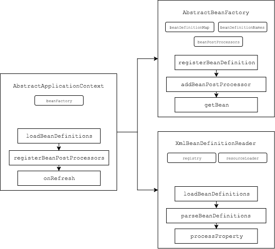

# TinySpring 源代码解析

TinySpring 项目实现了Spring框架的基础Bean容器与AOP功能，可作为入门源码以了解Spring容器的基本工作机理。

## Bean容器

Bean容器部分的源码如图所示：

1. `AbstractApplicationContext` 作为上下文管理器，借助`BeanDefinitionReader`于`BeanFactory`完成整体管控工作
2. 基于`BeanDefinitionReader`对XML配置文件完成解析工作，将配置中的Bean解析成`BeanDefinition`对象.
3. 解析完成的`BeanDefinition`对象会存储到`BeanFactory`中
4. 管理器会检索当前`BeanFactory`中的所有`BeanDefinition`，找出实现了`BeanPostProcessor`的所有`BeanDefinition`，初始化其实例`Bean`，并存储到`BeanFactory`
5. 通过`BeanFactory`的`getBean`方法可以访问对应`id`的`bean`，且返回`bean`实例为懒加载模式创建，首次访问时创建，创建时遍历`BeanPostProcessor`，完成创建后处理，返回到调用端。

## AOP功能

