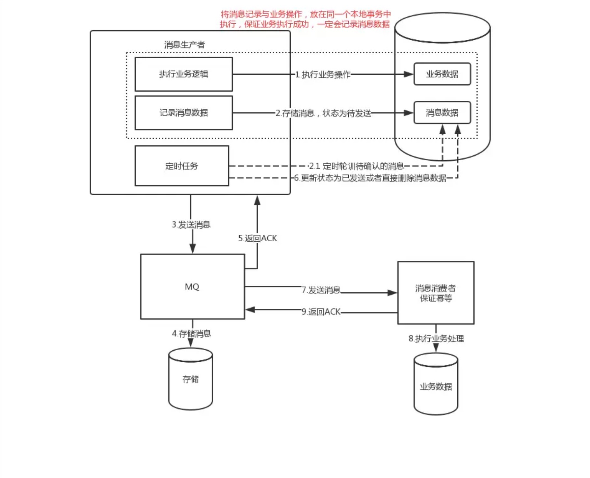

# 分布式事务

## 基本理论

ACID四个特性表述事务：

* Atomicity：原子性，事务中的所有操作要么都成功执行，要么都取消执行，不能存在部分执行，部分不执行的状态。
* Consistency：一致性，举个例子简单的理解就是，A、B两个账户各有100元，无论两个账户并发相互转账多少次，两个账户的资金总额依然是200元。
* Isolation：隔离性，并发事务之间的相互影响程度，隔离性也是分级别的：读未提交、读已提交、可重复读等。
* Durability：持久性，事务完成后对数据的更改不会丢失。

CAP 理论：

* 一致性 (Consistency) ： 客户端知道一系列的操作都会同时发生 (生效)
* 可用性 (Availability) ： 每个操作都必须以可预期的响应结束
* 分区容错性 (Partition tolerance) ： 即使出现单个组件无法可用, 操作依然可以完成

BASE 理论：

* Basically Available（基本可用）
* Soft state（软状态）
* Eventually consistent（最终一致性）

BASE 理论是对 CAP 中的一致性和可用性进行一个权衡的结果，理论的核心思想就是：我们无法做到强一致，但每个应用都可以根据自身的业务特点，采用适当的方式来使系统达到最终一致性

对于单数据库而言，单机事务能够很好的满足对于ACID的需求，然后随着系统复杂性增加，单机事务逐渐难以满足要求，转向于分布式事务

分布式事务的主要场景：

* 跨数据库分布式事务
* 跨服务分布式事务
* 混合式分布式事务

## 实践方式

### 两阶段提交（2PC）

分布式事务中的两阶段提交就是使用 XA 协议的原理， 同数据库事务中的XA一样，

XA规范中定义了分布式事务处理模型，这个模型中包含四个核心角色：

* RM(Resource Managers)：资源管理器，提供数据资源的操作、管理接口，保证数据的一致性和完整性。最有代表性的就是数据库管理系统，当然有的文件系统、MQ系统也可以看作RM。
* TM(Transaction Managers)：事务管理器，是一个协调者的角色，协调跨库事务关联的所有RM的行为。
* AP(Application Program)：应用程序，按照业务规则调用RM接口来完成对业务模型数据的变更，当数据的变更涉及多个RM且要保证事务时，AP就会通过TM来定义事务的边界，TM负责协调参与事务的各个RM一同完成一个全局事务。
* CRMs(Communication Resource Managers)：主要用来进行跨服务的事务的传播。

2PC，又叫做 XA Transactions：

* 第一阶段(准备阶段)：事务协调器要求每个涉及到事务的数据库预提交 (precommit) 此操作，并反映是否可以提交.
* 第二阶段(提交阶段)：事务协调器要求每个数据库提交数据。

* 预备阶段：

1. TM记录事务开始日志，并询问各个RM是否可以执行提交准备操作。
2. RM收到指令后，评估自己的状态，尝试执行本地事务的预备操作：预留资源，为资源加锁、执行操作等，但是并不提交事务，并等待TM的后续指令。如果尝试失败则告知TM本阶段执行失败并且回滚自己的操作，然后不再参与本次事务。（以MySQL为例，这个阶段会完成资源的加锁，redo log和undo log的写入。）
3. TM收集RM的响应，记录事务准备完成日志。

* 提交/回滚阶段：这个阶段根据上个阶段的协调结果发起事务的提交或者回滚操作。

* 如果所有RM在上一个步骤都返回执行成功，那么

1. TM记录事务commit日志，并向所有RM发起事务提交指令。
2. RM收到指令后，提交事务，释放资源，并向TM响应“提交完成”。
3. 如果TM收到所有RM的响应，则记录事务结束日志。

* 如果有RM在上一个步骤中返回执行失败或者超时没有应答，则TM按照执行失败处理，那么

1. 记录事务abort日志，向所有RM发送事务回滚指令。
2. RM收到指令后，回滚事务，释放资源，并向TM响应回滚完成。
3. 如果TM收到所有RM的响应，则记录事务结束日志。

优点： 尽量保证了数据的强一致，适合对数据强一致要求很高的关键领域。
缺点： 实现复杂，牺牲了可用性，对性能影响较大，不适合高并发高性能场景

### 补偿事务（TCC）

TCC 其实就是采用的补偿机制，其核心思想是：针对每个操作，都要注册一个与其对应的确认和补偿（撤销）操作

* Try 尝试执行,完成所有业务检查（一致性）, 预留必须业务资源（准隔离性）
* Confirm 确认执行真正执行业务，不作任何业务检查，只使用Try阶段预留的业务资源，Confirm操作满足幂等性。要求具备幂等设计，Confirm失败后需要进行重试。
* Cancel 取消执行，释放Try阶段预留的业务资源 Cancel操作满足幂等性Cancel阶段的异常和Confirm阶段异常处理方案基本上一致。

Try阶段何为预留业务资源，举个简单例子，库容100，预扣减2，Try阶段通过业务代码实现冻结库容2，而非真正扣减2，对外系统可见库容仍未100，实际可用为98，待Confirm阶段进行实际扣减，或者Cancel阶段取消冻结

优点： 跟 2PC 比起来，实现以及流程相对简单了一些，但数据的一致性比 2PC 也要差一些
缺点： 缺点还是比较明显的，在 2,3 步中都有可能失败。TCC 属于应用层的一种补偿方式，需要多写很多补偿的代码

### 基于消息的分布式事务

基于消息的分布式事务模式核心思想是通过消息系统来通知其他事务参与方自己事务的执行状态。消息系统的引入更有效的将事务参与方解耦，各个参与方可以异步执行。

该种模式的难点在于解决本地事务执行和消息发送的一致性：两者要同时执行成功或者同时取消执行

#### 消息队列

普通消息是无法解决本地事务执行和消息发送的一致性问题的，如果要通过消息队列解决分布式事务问题，则需要引入**事务消息**，注：部分消息队列支持事务消息，如RocketMQ

事务消息和普通消息的区别在于事务消息发送成功后，处于prepared状态，不能被订阅者消费，等到事务消息的状态更改为可消费状态后，下游订阅者才可以监听到次消息

本地事务和事务消息的发送的处理流程如下：

1. 事务发起者预先发送一个事务消息MQ；
2. MQ系统收到事务消息后，首先将消息持久化，消息的状态是『待发送』，并给发送者一个ACK消息；
3. 事务发起者如果没有收到ACK消息，则取消本地事务的执行；如果收到了ACK消息，则执行本地事务，并给MQ系统再发送一个消息，通知本地事务的执行情况。
4. MQ系统收到消息通知后，根据本地事务的执行情况更改事务消息的状态，如果成功执行，则将消息更改为『可消费』，并择机下发给订阅者；如果事务执行失败，则删除该事务消息。
5. 本地事务执行完毕后，发给MQ的通知消息有可能丢失了。所以支持事务消息的MQ系统有一个定时扫描逻辑，扫描出状态仍然是『待发送』状态的消息，并向消息的发送方发起询问，询问这条事务消息的最终状态如何并根据结果更新事务消息的状态。因此事务的发起方需要给MQ系统提供一个事务消息状态查询接口。
6. 如果事务消息的状态是『可发送』，则MQ系统向下游参与者推送消息，推送失败会不停重试。
7. 下游参与者收到消息后，执行本地事务，本地事务如果执行成功，则给MQ系统发送ACK消息；如果执行失败，则不发送ACK消息，MQ系统会持续推送给消息进行重试，要做幂等。

#### 本地消息表

事务消息对消息队列有着特殊要求，并非所有的消息队列都支持事务消息，可以考虑采用本地消息表方式，其核心思想是事务的发起方维护一个本地消息表，业务执行和本地消息表的执行处在同一个本地事务中

消息生产方，需要额外建一个消息表，并记录消息发送状态。**消息表和业务数据要在一个事务里提交**，也就是说他们要在一个数据库里面。

系统中启动一个定时任务定时扫描本地消息表中状态为『待发送』的记录，并将其发送到MQ系统中，如果发送失败或者超时，则一直发送，直到发送成功后，从本地消息表中删除该记录

消息消费方，需要处理这个消息，并完成自己的业务逻辑。此时如果本地事务处理成功，表明已经处理成功了，如果处理失败，那么就会重试执行。如果是业务上面的失败，可以给生产方发送一个业务补偿消息，通知生产方进行回滚等操作。

生产方和消费方定时扫描本地消息表，把还没处理完成的消息或者失败的消息再发送一遍。如果有靠谱的自动对账补账逻辑，这种方案还是非常实用的

优点： 一种非常经典的实现，避免了分布式事务，实现了最终一致性
缺点： 消息表会耦合到业务系统中，如果没有封装好的解决方案

#### 消息模式总结

两个关键问题：

* 如果consumer消费失败，是否需要producer做回滚呢？

答：基于消息的事务保证，本身是异步操作，producer不会因为consumer消费失败而做回滚，其所追求的是高可用和最终一致性，consumer消息消费失败的话，MQ自己会负责重推消息，直到消费成功。
因此，事务消息和本地消息表是针对生产端而言的，而消费端的一致性是通过MQ的重试机制来完成的。

* 如果consumer端因为业务异常而导致回滚，那么岂不是两边最终无法保证一致性?

答：基于消息的最终一致性方案必须保证消费端在业务上的操作没问题，它只允许系统异常的失败（即因系统异常造成的偶发问题），不允许业务上的失败，比如在你业务上抛出个NPE之类的问题，导致你消费端执行事务失败，那就很难做到一致了。

总体来看，基于消息的分布式事务可以将分布式系统之间更有效的解耦，各个事务参与方之间的调用不再是同步调用。

但是对业务实现也有一定的侵入性，要么提供事务消息状态查询接口，要么需要维护本地消息表。

并且原则上只接受下游分支事务的成功，不接受事务的回滚，如果失败就要一直重试，适用于对最终一致性敏感度较低的业务场景，例如跨企业的系统间的调用，适用的场景有限

* [聊聊分布式事务，再说说解决方案](https://www.cnblogs.com/savorboard/p/distributed-system-transaction-consistency.html)
* [再有人问你分布式事务，把这篇扔给他](https://juejin.im/post/5b5a0bf9f265da0f6523913b)
* [关于分布式事务、两阶段提交协议、三阶提交协议](https://www.hollischuang.com/archives/681)
* [终于有人把“TCC分布式事务”实现原理讲明白了](https://www.cnblogs.com/jajian/p/10014145.html)

