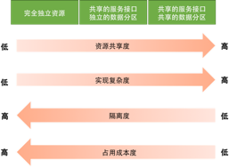
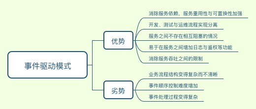

# 分布式系统弹力设计笔记

弹力设计又称为容错设计，着眼于分布式系统的各种 “容忍” 能力，包括：

* 容错能力（服务隔离、异步调用、请求幂等性）
* 可伸缩性（有/无状态的服务）
* 一致性（补偿事务，充实机制）
* 应对大流量的能力（熔断、降级）

目标： 在确保系统正确性的基础上，保障系统的可用性

系统可用性度量：

$Availability=\frac{MTTF}{MTTF +MTTR}$

* MTTF：Mean Time To Failure 即平均故障前时间，其实也就是正常服务时间，越长越好
* MTTR：Mean Timer To Recovery 即故障修复时间，越短越好

系统可用性标准衡量：

既然弹力设计针对的是应对系统各种故障（错误）的能力，那么系统出现各种问题的原因有哪些呢？ 

1. 网络问题：网络故障导致的链接出错，或者网络拥塞等
2. 性能问题：数据库慢查询，Java Full GC，磁盘IO量过大，CPU过高，内存不足
3. 安全问题：网络攻击，如DDOS攻击等
4. 运维问题：系统总是在被更新和修改，架构也在不断地被调整
5. 管理问题：没有梳理出关键服务以及服务的依赖关系，运行信息没有和控制系统同步
6. 硬件问题：硬盘损坏，网卡问题，交换机问题，断电问题

那么面对这些问题，我们能做的是什么？

**将故障处理作为正常功能逻辑加入到系统功能序列，故障时正常且不可预见的**

## 隔离设计

所谓隔离设计，可以理解为系统的”隔板“，当系统出现问题时，问题的影响面不会无限制的延伸，而是会被”隔板“限制在既定范围之内

隔离的方式有哪些呢？

* 服务隔离，也就是常说的微服务，将不同业务模块划分到不同的服务系统中，不同系统之间不存在直接的依赖关系，彼此之间也不存在故障影响关系，如商品服务与用户服务完全独立存在于两套系统中
	* 优势：微服务化之后各个服务之间解耦合，互不影响，在复用程度上也会得到有力提升
	* 劣势：一次批量服务访问的响应时间增加，服务之间的协同任务（数据协同）会变得困难且复杂
* 请求隔离，同一服务针对不同用户群进行对应，即将用户分组，特定用户组访问指定的服务实例，当服务实例出现故障时仅仅影响一部分用户使用，就是所谓的”多租户“模式，
	* 完全独立，即独立的数据与服务
	* 部分独立，独立的数据与共享的服务
	* 完全共享，共享的数据与服务

## 异步通讯设计

针对消息通讯机制而言，主要分为同步与异步两类，对于同步调用而言，其会将系统之间耦合与接口，且对于实时性要求也会比异步调用要高

同步调用会存在以下的问题：

* 同步调用中，被调用方的吞吐需要不低于调用方的吞吐
* 调用方将一直等待被调用返回结果
* 同步调用通常是一对一的
* 被调用方出现问题，调用方也会随之出错

在此问题基础上，考虑异步通讯的优势

异步通讯的三种方式：

* 请求响应式，收到请求后直接返回，即收到请求并正在处理中，那么调用方如何拿到结果呢？
	* 调用方轮询，调用方不断尝试询问被调用方的处理结果，知道数据准备好返回结果
	* 调用方注册回调方法，被调用方处理完成后回调请求调用方，典型如支付时候从商家跳转到支付页面，会将回调URL传给支付页面，完成后跳转到该URL
* 订阅方式，接收方订阅发送发的消息，发送方会将订阅消息交由订阅队列处理器发送到订阅方，而发送方并不需要关心消息的处理结果
* Broker方式，发送方与接受方完全解耦，相互不直接联系，而是通过中间Broker完成消息发送与订阅，那么这对Broker提出了很高的要求：
	* 必须是高可用的
	* 必须是高性能且可扩展性好的
	* 必须是持久化的，保证数据不会丢失

三种方式中，前两种方式都存在一定程度上的业务依赖，而第三种方式是完全消除了业务依赖。

上述中的订阅方式与Broker方式，就是**事件驱动模式**，其中最好的便是Broker模式，因为其彻底解除了业务之间的耦合关系。事件驱动存在自身的优势与劣势

基于Broker模式的异步驱动模型完成异步通讯机制的设计，使得异步通讯能够达到以下效果：

* 业务解耦，各服务之间的业务不直接依赖
* 服务隔离，各服务之间的故障影响不传递
* 性能隔离，各服务之间的吞吐量互不影响
* 流量隔离，利用Broker以消息堆积方式实现”削峰“
* 简便维护，服务独立方便业务维护与扩展工作

## 幂等设计

幂等，通俗来说就是针对于一个方法的执行，执行一次与多次的结果是一样的

为何需要幂等的考量？ 对于各个独立服务而言，服务之间的调用过程（这里一般指的是消息）可能出现三类结果：成功、失败与超时，前两者是明确的，后者是未知的

对于这类未知状态，通常的做法是**重试**，而重试过程可能导致服务在一个处理阶段被多次调用的情况，那么如何消除多次调用的影响称为问题的关键，这也是幂等存在的必要性

如何实现幂等，答案是**全局ID**，也就是为每次调用（通常是消息）指定一个标识 ID，并且这个 ID 是全局唯一的，这个ID可以由中心系统提供，但必须保证是不重复的

Twitter 的开源项目 Snowflake 提供了全局ID的一种实现方式，Redis 和 MongoDB 都提供了全局 ID 生成的实现方式

具体的实现方式：

* 服务接受到消息之后，先将消息记录插入到数据库中
* 若插入成功，则执行消息对应的逻辑处理操作
* 若插入冲突，表示该消息已经被接受处理，则放弃后续操作

## 服务状态

对于分布式系统而言，无状态服务是其设计的最佳实现与铁律，那么系统服务的状态指的是哪些呢？

* 程序调用的结果
* 服务组合的上下文
* 服务的配置

要做出无状态的服务，通常需要将服务的状态转移并保存在第三方，但是带来的副作用是服务与第三方之间出现耦合，且对第三方存储的可用性与扩展性提出了很高的要求

## 补偿事务

