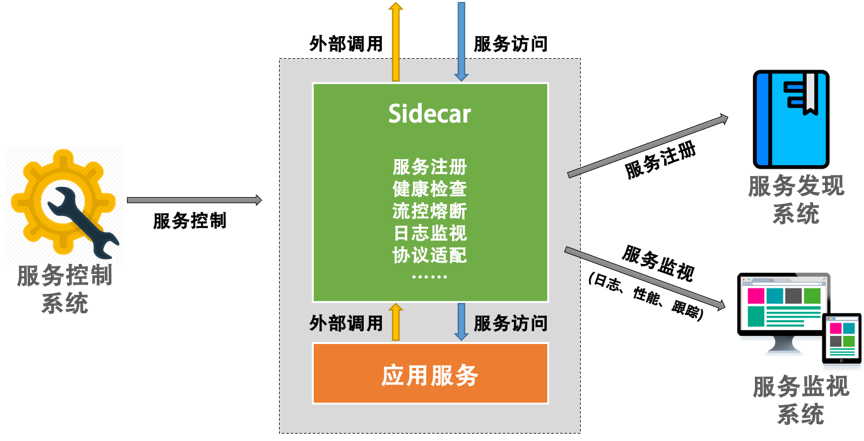
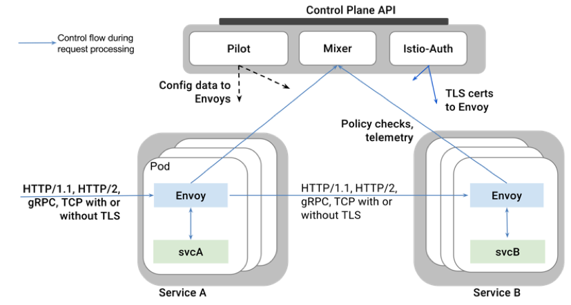

# 分布式系统管理设计笔记

## 分布式锁

分布式锁服务的几个特点：

* 安全性：任何时候，只会有一个客户端拥有锁
* 死锁避免：客户端最终都能获得锁
* 容错性：只要锁服务集群的大多数节点存活，服务就能正常运作 

### 通过 Redis 实现分布式锁服务

加锁：

`SET resource_name my_random_value NX PX 30000`

原理在于： 只有当key不存在时，才会设置成功该key值，当多个客户端并发操作时，只会有一个成功，Redis自身会保证操作的原子性

解锁：

```python
if redis.call("get", KEYS[1]) == ARGV[1] then
	return redis.call("del", KEYS[1])
else 
	return 0
end

```

原理：解锁的时候会先判断一下key对应的value是否与自身（锁持有者）设置的值一致，若一致则释放锁（删除key值），若不一致，则不进行操作，这是为了防止因为锁超时释放，而持有者误删除后续锁持有者所创建的key值

问题：

如果A获得锁，但是执行过程中被阻塞，达到一定时间长度后，锁超期释放，客户端B申请并获得锁，进行更新操作， 而此时A从阻塞状态恢复，作为锁的持有方进行数据更新操作，导致冲突异常。如何解决？

方案：

为每次申请到的锁附上一个版本号，数据更新操作时，带上锁版本号进行更新（写入数据库），每次更新进行检查版本号，只允许新版本锁服务进行更新


### 乐观锁

如果在数据库中保留版本号，那么直接使用数据库就能完成锁的操作，而并不需要Redis的辅助，可以给数据库表中增加version字段，每次数据更新都将version加一，每次读取数据也将version读出。

每次提交更新时，都将取出的version信息与之前取出的进行对比，如果一致则更新数据，如果不一致则认为数据过期

`UPDATE table_name SET xxx = #{***}, version=version+1 where version = #{version}`

其实这就是乐观锁的实现。

甚至，我们也不需要增加version字段，直接对比前后数据的变化

```
select stock from tb_product where product_id=#{product_id}
update tb_product set stock=stock-#{num} where product_id=#{product_id} and stock=#{stock}
```

在操作系统里边，这就是CAS操作（Compare and Swap）。

那么什么时候使用分布式锁，什么时候直接采用乐观锁的实现方式呢？

首先需要明确一个问题：用锁来实现对共享数据源的修改操作，还是不同进程之间的同步互斥操作？

前者可以直接使用CAS乐观锁（无锁方式），后者需要真正的锁。

## 配置中心

通常，软件系统的配置参数，如账户密码、执行参数等信息会独立配置到文件当中，如SpringBoot框架下的application.properties，但是这种方式存在一些弊端：

* 配置信息不能实时更新
* 分布式系统中同步配置较为繁琐

所以，在分布式环境下，我们需要一个集中式的配置中心来完成对于应用参数信息的集中管理
 
 主要步骤如下：
 
 1. 从配置中心录入配置信息
 2. 配置中心发出通知到配置变更控制器（通常在应用上，长连接）
 3. 控制器向配置中心拉取配置信息
 4. 控制器更新应用的配置信息，这里可能涉及到配置的reload和服务重启等


## 边车模式

系统一般包含两个部分，业务逻辑部分与控制逻辑部分，业务逻辑顾名思义，控制逻辑包括监视、日志记录、限流、熔断、服务注册与发现等。在系统实现过程中我们通常希望能够实现业务逻辑与控制逻辑的分离，控制逻辑更可能作为通用的服务，这样开发者仅仅只需要关注于自身的业务。

那么Sidecar能为我们做什么事情呢？

* SideCar 可以帮助服务注册，并完成服务的健康检查
* 当需要调用外部服务时，Sidecar可以帮助发现外部服务，并完成服务路由
* Sidecar接管应用的出入流量，可以实现日志监视、调用链路跟踪、流控熔断等

总之，引入Sidecar之后，应用服务可以专注于业务逻辑，而将控制逻辑交给Sidecar



通常，Sidecar与应用服务部署在同一台机器，Sidecar可以访问服务所能访问的所有资源，也能监控应用服务的进程信息。

Sidecar适合的场景：

* 对老应用系统的改造，不需要侵入原有逻辑代码
* 对多语言或者的分布式系统进行管理与扩展
* 应用服务来源于不同的提供商
* 控制与业务进行分离

那么Sidecar不适合怎样的场景呢？

* 架构简单的场景不需要这种模式，直接使用API Gateway或者NGINX结合HAPorxy即可
* 服务间的协议不标准且无法转换
* 不需要分布式的架构

## 服务网格

什么是服务网格（Service Mesh），其实就是Sidecar集群，每一个服务应用都有对应的Sidecar，管理服务的控制逻辑，服务只与Sidecar交互，并由Sidecar代理同其他系统服务的交互与控制，这样的话，服务就能轻易地加入到服务网格中，真正做到业务逻辑与控制的隔离。


服务仅仅与对应的Sidecar交互，组合形成一个网格，不同网格之间由各自的Sidecar进行连接，形成整体的服务网格（Service Mesh）


再机上对整个集群的管理控制面板，就形成了整体的Service Mesh架构：


形成的服务网格控制集群如下：


对于Service Mesh架构而言，当前主流的解决方案是 [Istio]() ，其Sidecar称作Envoy（使者），主要用于管理服务的出入流量，提供服务发现、负载均衡与限流熔断等功能；在Service Mesh的控制面板上，Istio 提供了一个 Mixer 收集器，手机从Envoy监控到的流量特征与性能指标，并通过Piilot控制器将相关的规则发送到Envoy。Istio的整体架构图如下：


参见：

[Pattern: Service Mesh](http://philcalcado.com/2017/08/03/pattern_service_mesh.html)

## 网关模式


## 部署升级